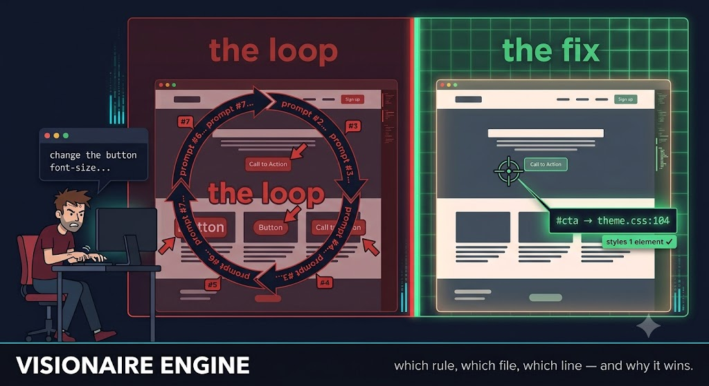

# Visionaire Engine

> **Which rule, which file, which line — and why it wins.**

[](https://www.npmjs.com/package/visionaire-engine)
[](https://github.com/mi60dev/visionaire-engine/actions/workflows/ci.yml)
[](LICENSE)

[](https://glama.ai/mcp/servers/mi60dev/visionaire-engine)


**The problem:** Something looks off. You screenshot it, explain it, the LLM guesses wrong, you re-explain.

**The solution:** Visionaire reads the live page and hands the LLM the exact rule, file, and line. Right fix, first try.



**You shouldn't have to write a paragraph to explain a 2px margin bug — and now you don't.** Less explaining, more fixing: built for developers, vibe coders, and anyone shipping site design changes with an LLM in the loop.

**Status: v0.7** — 28 tools, 435 tests (252 unit + 183 end-to-end on real Chrome), a 24-case seeded-bug benchmark (`npm run bench`), verified live against wordpress.org.

<details>
<summary><strong>What's new, by version</strong></summary>

- **v0.7 — the verification layer:** `assert_visual` (a 17-type assertion grammar — PASS/FAIL verdicts with measured pixels, offending uids, and re-runnable named suites), `visual_diff` (pixel diff vs a mockup or recorded baseline, divergent regions mapped to element uids), `impact_preview` (blast radius + sandboxed dry-run before editing a shared selector), `diagnose` (ranked "why is this broken" culprits with measured evidence), `responsive_sweep` (one call → per-viewport verdict matrix), `capture_proof` (before/after evidence bundles with a verdict delta); the verify-after-edit harness for Claude Code and Cursor (`npx visionaire-engine init-harness`); `style_diff { capture_pixels }` baselines; `check_alignment` deprecated in favor of `assert_visual`
- **v0.6 — the pixel-perfect pack:** `check_alignment` (group alignment / gap-rhythm / grid / pixel-snap audit) and `pick_color` (actual painted-pixel sampling + WCAG contrast verdicts)
- **v0.5:** `inject_css` — the live fix loop (trial a fix on the page, see what changed, converge, write source once); `navigate { bypassCache }` for stale-stylesheet hard reloads; blast-radius + scoped-fix reporting on `explain_styles` (change *the* button, not all buttons)
- **v0.4 (field-report items):** `interact` to drive the UI into a state and inspect it; `measure_element` for sub-pixel glyph/text-ink centering; an `evaluate` escape hatch; element-scoped crops/zoom on `annotated_screenshot`; `match:"any"` / `visibleOnly:false` on `find_elements`; zero-config cold-start Chrome discovery
- **v0.3:** the time dimension — event-listener attribution, animation diagnosis, source-attributed interaction timelines
- **Hardened for untrusted pages:** prompt-injection sanitization, fail-fast watchdog, dialog auto-dismiss

</details>

## The gap

Ask an LLM to fix a visual bug today and it gets one of two incomplete pictures: pixels, with no link back to code, or code, with no rendering truth about what's actually winning on screen. Existing browser MCPs make this worse for design work specifically — they ship accessibility snapshots that deliberately strip out all styling. What's missing is **explanation and attribution**:

- *Which* CSS rule wins the cascade for this property, and why did the others lose?
- *Which file, which line* does the winner live in — or which Elementor widget control, or which Customizer entry?
- *Why* is this element invisible, misaligned, or the wrong size?

Visionaire answers those questions with zero AI inside — everything is computed deterministically from the Chrome DevTools Protocol plus closed rulesets. The fuzzy part (matching "the button under the hero looks off" to an actual element) stays with the calling LLM, which gets uid-keyed snapshots, search tools, and annotated screenshots to do that cheaply.

## What the output looks like

Live against wordpress.org:

```
why color = rgb(255, 255, 255):
  WINNER  [class*=wp-block] .wp-block-button__link { color: var(--wp--custom--button--color--text) }  spec(0,2,0)
    → themes/wporg-parent-2021/build/style.css:499  [line | theme: wporg-parent-2021 — edit themes/wporg-parent-2021/build/style.css]
  lost (specificity)  :root :where(.wp-element-button, .wp-block-button__link) { color: #fff }  spec(0,1,0)
    → global-styles-inline-css:2  [db-entity | Global Styles — Site Editor → Styles (theme.json / wp_global_styles)]
  lost (origin)  a:-webkit-any-link { color: -webkit-link }  spec(0,1,1)
    → user-agent stylesheet
```

Winner, losers with the decisive loss reason, and an honest edit pointer for each — including WordPress-aware answers like "Site Editor → Styles" instead of a useless path to a generated file.

## Quick start

Requires Node ≥ 20 and Chrome/Chromium installed.

Fastest path — register straight from npm with Claude Code (no clone, no build):

```bash
claude mcp add visionaire -- npx -y visionaire-engine
```

Or run from a clone (for development or a pinned local build):

```bash
git clone https://github.com/mi60dev/visionaire-engine && cd visionaire-engine
npm install && npm run build
claude mcp add visionaire -- node "$PWD/dist/index.js"
```

Using **GitHub Copilot, Cursor, Claude Desktop, Google Antigravity**, or another client? See **[docs/clients.md](docs/clients.md)** for a copy-paste config for each, plus browser-install help for Linux/WSL/Docker.

**Run it from your project's root directory** — Visionaire is at its best when the agent has both the running site *and* its source on disk, so it can cross-reference the two. Ground before you search: take a `page_snapshot` (or read the source) to get real element names instead of guessing selectors. If a selector matches nothing, the error suggests the closest real ids/classes on the page.

Then, in a session:

1. `connect { url: "https://your-site.com" }` — launches Chrome (or `{ browserUrl: "http://127.0.0.1:9222" }` to attach to your real, logged-in browser)
2. `page_snapshot {}` — a uid-keyed census of what's visible; **target elements by their `uid`**, not invented selectors
3. `explain_styles { uid: "e17", property: "margin-bottom" }` — cascade verdict with file:line

Try it without an MCP client:

```bash
npm run demo                                              # bundled fixture
npm run demo -- https://wordpress.org --selector "a.wp-block-button__link"
```

## The 28 tools

**Session & grounding** — get connected and find the right element without guessing.

| Tool | Purpose |
|---|---|
| `connect` / `navigate` / `set_viewport` | Launch or attach to Chrome, go to a URL (`bypassCache` for hard reloads), emulate viewports |
| `page_snapshot` | Pruned, uid-keyed tree of what's visible — geometry, layout hints, invisibility reasons |
| `page_origins` | Stylesheet inventory + platform detection (WordPress version, theme, builders, optimizers) |
| `find_elements` | Deterministic search by text, selector, role, or screen region — AND-combined by default, `match:"any"` for a union, `visibleOnly:false` to include hidden elements |
| `node_at_point` | x,y → element uid + ancestor chain |
| `pick_element` | Human-in-the-loop grounding: DevTools-style hover highlight, the user clicks the element that looks wrong |

**Explanation** — the "why," with a receipt.

| Tool | Purpose |
|---|---|
| `inspect_element` | The "what": box model, computed values, visibility verdict |
| `explain_styles` | **The wedge.** Cascade winner/loser per property with file:line + origin attribution, each winner's **blast radius** (how many other elements it styles), and a scoped-fix selector for just this element |
| `inspect_ancestors` | Constraint-chain walk: which ancestor constrains width/overflow/stacking |
| `get_listeners` | Event listeners on an element + its ancestors, with handler file:line and capture/passive/once flags |
| `explain_animations` | Animations/transitions touching an element: live census, declared rules with file:line, and a closed "why is it not smooth" ruleset |

**Pixel-level checks** — new in v0.6.

| Tool | Purpose |
|---|---|
| `measure_element` | Sub-pixel rendered geometry: content box + true text-ink box (glyph extents) with a centering verdict — "is this × actually centered?" |
| `check_alignment` | *(deprecated → `assert_visual`)* Group pixel audit: which of N elements is off-alignment by how many px, gap-rhythm outliers, size consistency, N-px grid conformance, pixel-snap warnings |
| `pick_color` | The actual painted pixel (composited truth: gradients, images, opacity) + computed colors + WCAG AA/AAA contrast verdict |

**Interaction & time** — states, not just snapshots.

| Tool | Purpose |
|---|---|
| `interact` | Drive the UI into a state (open a menu/popup/modal, reveal a tab) and **leave it there** so you can inspect the new state — reports post-action visibility + box |
| `record_interaction` | One interaction → a source-attributed causal timeline: handlers, mutations, cancelled transitions, layout shifts |

**Fixing & verifying**

| Tool | Purpose |
|---|---|
| `inject_css` | The live fix loop: trial declarations on an element (or a page-wide rule) without touching source — see what changed, converge, write source once, revert |
| `style_diff` | Record styles, compare later — verify-my-fix loops |
| `evaluate` | Escape hatch: run agent-authored JavaScript in the page and get the JSON result, for the genuinely bespoke case no other tool covers |
| `annotated_screenshot` | Screenshot with numbered marks that equal snapshot uids — or an element-scoped crop via `clipTo` with `padding`/`scale` zoom and optional `annotate:false` |

**Verification & proof** — new in v0.7.

| Tool | Purpose |
|---|---|
| `assert_visual` | **The verification gate.** State rendered-geometry claims (equal heights, alignment, gaps, clipping, colors, z-order — 17 assertion types) → deterministic PASS/FAIL with measured pixels and offending uids; register named suites and re-run them after every edit |
| `visual_diff` | Pixel-diff the live page (or one element) against a mockup PNG or a recorded baseline — MATCH/DIVERGENT with divergent regions mapped back to element uids, optional heatmap artifact |
| `impact_preview` | Blast-radius report before editing a shared selector: who else matches, grouped with uids, plus a sandboxed dry-run predicting exactly which elements would change |
| `diagnose` | One-shot "why does this look broken" — ranked culprits with measured evidence for clipping, overflow, off-center, invisibility, overlap, wrong size |
| `responsive_sweep` | One verification payload across many viewports → a per-viewport verdict matrix ("fixed on desktop, still broken on mobile" caught in one call) |
| `capture_proof` | Before/after evidence bundles: annotated screenshots + suite verdicts, with a verdict delta proving the fix flipped FAIL → PASS |

Full reference: [docs/tools.md](docs/tools.md)

## The verify loop (stop the CSS gaslighting)

An agent edits a stylesheet, reads its own diff, and declares "now the cards are equal height" — without ever seeing a rendered pixel. Visionaire gives your agent deterministic eyes on rendered truth. The loop:

1. **Preview** shared-class blast radius → `impact_preview`.
2. **Edit** the smallest change.
3. **Assert** your claim → `assert_visual` (or re-run a named `suite_id`). You get PASS/FAIL + the actual measured pixels + the offending element uids.
4. **Diagnose** any FAIL → `diagnose` returns the ranked culprit with evidence.
5. **Sweep** responsive → `responsive_sweep` returns a per-viewport verdict matrix.
6. **Prove** it → `capture_proof` bundles before/after screenshots + verdict delta.

Real output — the same suite before and after a fix:

```json
{
 "verdict": "FAIL",
 "summary": "1 assertion: 0 PASS, 1 FAIL — registered as suite 'cards' (re-run with just {\"suite_id\":\"cards\"})",
 "results": [
  { "type": "equal_height", "verdict": "FAIL", "id": "cards-equal",
    "measured": { "values": [412, 388], "unit": "px", "delta": 24, "tolerance_px": 1 },
    "offending_uids": ["e1", "e2"] }
 ],
 "truncated": false, "suite_id": "cards"
}
```

…fix the CSS, re-run with just `{ "suite_id": "cards" }`:

```json
{
 "verdict": "PASS",
 "summary": "1 assertion: 1 PASS, 0 FAIL",
 "results": [
  { "type": "equal_height", "verdict": "PASS", "id": "cards-equal",
    "measured": { "values": [412, 412], "unit": "px", "delta": 0, "tolerance_px": 1 } }
 ],
 "truncated": false, "suite_id": "cards"
}
```

Run `npx visionaire-engine init-harness` from your project root to wire the included Claude Code hooks (or Cursor rule) so the agent physically cannot end a turn claiming "it's fixed" without a verification pass on record. How the markers, hooks, and Stop gate work: [docs/harness.md](docs/harness.md).

## Documentation

- [docs/clients.md](docs/clients.md) — install in Claude, Copilot, Cursor, Antigravity, and other MCP clients
- [docs/tools.md](docs/tools.md) — tool-by-tool reference with real examples
- [docs/harness.md](docs/harness.md) — the verify-after-edit harness (hooks, markers, `init-harness`)
- [docs/architecture.md](docs/architecture.md) — how the deterministic pipeline works
- [docs/wordpress.md](docs/wordpress.md) — WordPress origin resolution guide
- [docs/development.md](docs/development.md) — building, testing, extending

## Design principles

1. **No internal LLM** — deterministic, cacheable, testable, host-agnostic.
2. **Fuzzy grounding belongs to the calling LLM**; we make it cheap.
3. **Complement the incumbent browser MCPs** (same uid idiom), don't compete.
4. **Honesty ladder** on every attribution: `line > file > db-entity > component > generated > unknown`.
5. **Token-budgeted output** — a dossier is 300–800 tokens, never a dump.

## Security posture

Visionaire is pointed at arbitrary, untrusted pages, so it treats page content as hostile:

- **Prompt-injection defense.** Page-derived strings (element text, class names, ids, attribute values) are sanitized at the single choke point where they enter tool output — collapsed to one line, stripped of control and bidirectional-override characters, and length-capped. A page cannot smuggle instruction-shaped text formatted as a "system message" toward the calling LLM; such content can only appear as an inert, quoted, truncated fragment.
- **Fail-fast, never hang.** Every tool call is wrapped in a watchdog (default 60s, `VISIONAIRE_TOOL_TIMEOUT_MS` to override; `pick_element`/`record_interaction` get their declared wait plus slack). A wedged browser returns an actionable error telling you to `connect` again, instead of blocking the client.
- **No dead-locking dialogs.** Page `alert()`/`confirm()`/`prompt()` calls are auto-dismissed — otherwise they would block every evaluate-family CDP call indefinitely.

Visionaire never executes page-authored code as instructions; it only reads and attributes. The calling LLM should still treat tool output as data about a page, not as commands.

## Known limitations

- Chromium-only (CDP is the only path to matched-rule source locations; `getMatchedCSSRules` was removed from browsers years ago).
- `@layer`: unlayered-vs-layered ordering is exact; ordering between two *different* layer chains is a deterministic proxy (CDP doesn't expose layer declaration order).
- Some CDP fields we rely on (`specificity`, `layers`) are experimental; the engine feature-detects them and falls back (e.g. to its own specificity parser), and a contract smoke test in `test/e2e.test.ts` fails loudly if a Chrome update breaks the core protocol shape (the experimental fields are logged as present/absent).

## Support

Visionaire is free and open source. If it saves you time and you'd like to help keep development going, you can chip in on [Ko-fi](https://ko-fi.com/mishonyai) or [Patreon](https://www.patreon.com/cw/MishonyAI). Completely optional, and genuinely appreciated. Bug reports and field notes help just as much — see [CONTRIBUTING.md](CONTRIBUTING.md).

## License

**[Apache License 2.0](LICENSE)** — free for everyone, including commercial use, with a patent grant. Copyright © 2026 mi60dev ([NOTICE](NOTICE)).

Built and maintained by [@mi60dev](https://github.com/mi60dev). Contributions welcome under the Apache-2.0 terms — see [CONTRIBUTING.md](CONTRIBUTING.md).